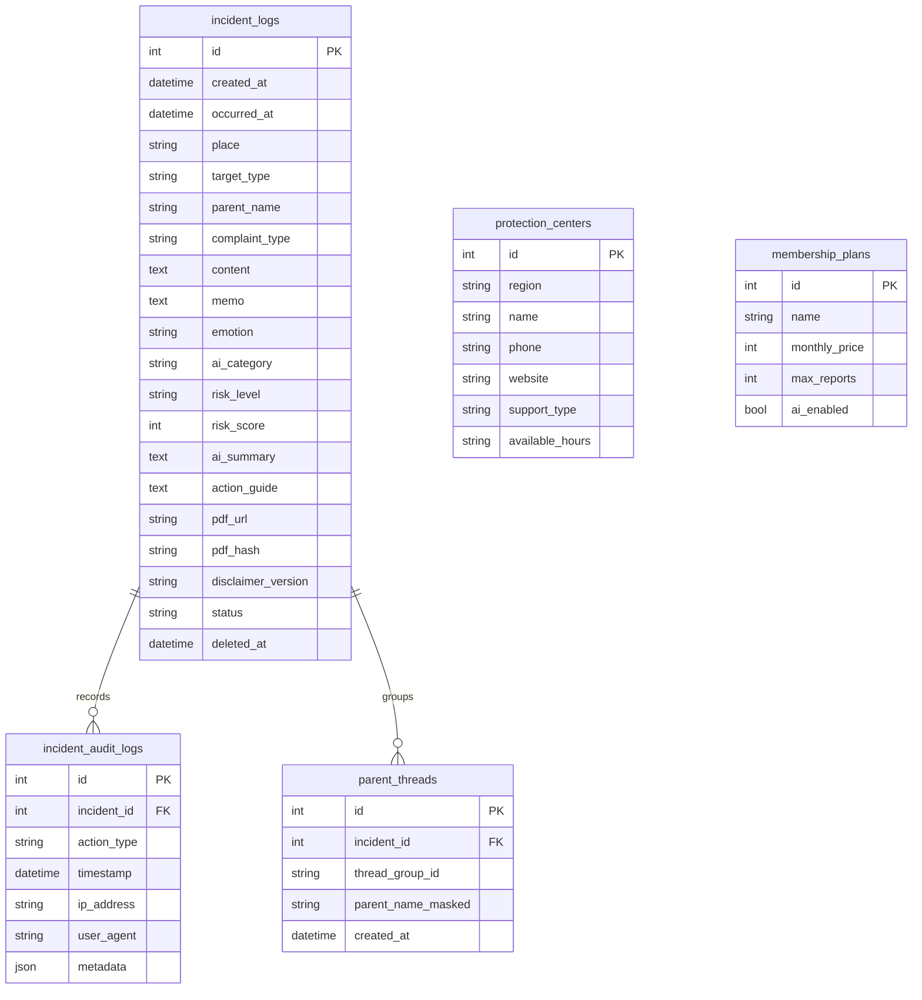

# 교권보호 도우미 - 민원방패

교사가 학부모 민원, 교육활동 침해, 반복적 부당 요구를 기록하고 AI 기반 위험도 분석과 대응 가이드를 확인하는 웹 기반 MVP입니다.

이번 버전은 단일 사건 기록 도구에서 **B2B/학교 납품형 운영 구조**로 확장했습니다. 반복 민원 추적, 관리자 협업, 보호센터 연결, 이메일 공유 mock, 상태 관리, Audit Timeline을 포함합니다.

## 주요 기능

- 민원 기록 입력: 발생 일시, 장소, 대상, 민원 유형, 상세 내용, 첨부 메모, 감정 상태
- 샘플 민원 분석: 홈 화면에서 5개 실전형 샘플을 선택해 기록 페이지에 자동 입력
- 음성 기록 및 녹취 업로드: Web Speech API, mp3/wav/m4a mock transcript
- 개인정보 마스킹: 전화번호, 학생 이름, 보호자 이름, 주소를 저장 전 자동 마스킹
- AI 위험도 분석: LOW, MEDIUM, HIGH 및 0~100점 점수화
- 사건 상태 관리: `NEW`, `REPORTED`, `IN_REVIEW`, `CLOSED`, `ESCALATED`
- 반복 민원 Thread: 선택 입력한 보호자명을 마스킹 저장하고 원본 비저장 해시 기준으로 묶어 최근 30일 3건 이상이면 경고
- 관리자 협업: 관리자 공유용 요약 복사, 관리자 이메일 전송 mock
- 보호센터 연결: HIGH 위험도일 때 지역 기반 교육활동보호센터 추천
- Audit Log Timeline: 생성, 분석, PDF 생성, 조회, 상태 변경, 이메일 전송 이력 표시
- PDF 무결성: SHA256 기반 Document Integrity Hash 저장 및 PDF 하단 출력
- Dashboard 확장: 반복 민원 건수, 진행중 사건 수, 종료된 사건 수, 고위험 사건 수, 교권 안전 점수
- 유료화 대비 구조: `membership_plans` 테이블과 Free, Basic, Pro 초기 데이터
- 운영 안전장치: 단일 기록 soft delete, demo 전용 전체 기록 초기화, metadata 포함 Audit Log
- 보호센터 Quick Access: 헤더에서 서울·경기·부산·대구·인천 센터 연락처와 운영시간 확인

## APP_MODE

백엔드 `.env`와 프론트엔드 `.env.local`에 운영 모드를 설정합니다.

```env
APP_MODE=demo
NEXT_PUBLIC_APP_MODE=demo
```

- `demo`: 샘플 민원, 전체 기록 초기화, 녹취 업로드 mock, 이메일 전송 mock을 허용합니다.
- `production`: 샘플과 초기화 버튼 및 개발용 mock UI를 숨깁니다.

실서비스 공개 시 두 값을 모두 `production`으로 변경하십시오. Docker Compose는 루트 `.env`의 `APP_MODE`를 frontend와 backend에 전달합니다.

## 기술 스택

- Frontend: Next.js 15 App Router, TypeScript, TailwindCSS, Shadcn 스타일 컴포넌트
- Backend: FastAPI, SQLAlchemy, Pydantic
- DB: 로컬 기본 SQLite, Docker 환경 PostgreSQL
- AI: provider abstraction 구조. MVP 기본값은 `local` 규칙 기반 분석기
- PDF: ReportLab
- Email: SMTP mock `email_service.py`
- STT 준비 구조: `transcription_service.py` mock interface

## ERD



## 권장 실행 위치

프로젝트는 어느 폴더로 옮겨도 실행되도록 상대경로 기준으로 구성되어 있습니다. 다만 OneDrive 동기화 폴더에서는 Next.js의 빌드 추적과 다수 파일 접근 시간이 길어질 수 있으므로 `C:\dev` 같은 로컬 개발 폴더를 권장합니다.

권장 위치:

```text
C:\dev\teacher-rights-shield
```

예를 들어 현재 프로젝트 폴더를 위 위치로 복사한 뒤 아래 명령을 실행합니다.

```powershell
cd C:\dev\teacher-rights-shield
```

`run-frontend.cmd`와 `run-backend.cmd`는 실행한 터미널의 현재 위치가 아니라 **스크립트가 있는 프로젝트 폴더**를 기준으로 이동합니다. 따라서 한글, 일본어, 공백이 포함된 경로에서도 동작합니다.

백엔드의 `.env`, 기본 SQLite DB, `storage/reports` 경로도 `backend` 폴더를 기준으로 해석됩니다.

## 로컬 실행

### 1. 백엔드

```powershell
cd C:\dev\teacher-rights-shield\backend
python -m venv .venv
.\.venv\Scripts\Activate.ps1
python -m pip install -r requirements.txt
copy .env.example .env
uvicorn app.main:app --reload --port 8000
```

PowerShell 실행 정책으로 가상환경 활성화가 차단되면 활성화 없이 직접 실행할 수 있습니다.

```powershell
cd C:\dev\teacher-rights-shield\backend
.\.venv\Scripts\python.exe -m pip install -r requirements.txt
.\.venv\Scripts\python.exe -m uvicorn app.main:app --reload --port 8000
```

프로젝트 루트의 실행 스크립트도 사용할 수 있습니다.

```powershell
cd C:\dev\teacher-rights-shield
.\run-backend.cmd
```

스크립트는 `backend\.venv\Scripts\python.exe`, `py -3`, `python` 순서로 사용 가능한 Python을 찾습니다. 실행 실패 시 원인을 표시하고 `pause` 상태로 유지합니다.

### 2. 프론트엔드

```powershell
cd C:\dev\teacher-rights-shield\frontend
copy .env.example .env.local
npm install
npm run dev
```

또는:

```powershell
cd C:\dev\teacher-rights-shield
.\run-frontend.cmd
```

`run-frontend.cmd`는 `node_modules`가 없으면 `npm install`을 먼저 실행합니다. 실패 시 오류 메시지를 표시하고 창이 바로 닫히지 않도록 `pause` 처리합니다.

접속:

- Frontend: http://localhost:3000
- Backend docs: http://localhost:8000/docs

## Next.js 빌드 점검

일반 빌드:

```powershell
cd C:\dev\teacher-rights-shield\frontend
npm run build
```

이전 빌드 캐시를 제거한 깨끗한 빌드:

```powershell
cd C:\dev\teacher-rights-shield\frontend
Remove-Item -Recurse -Force .next -ErrorAction SilentlyContinue
npm run build
```

의존성 손상이나 프로젝트 이동 후 네이티브 모듈 문제가 의심되면 `node_modules`를 재설치합니다.

```powershell
cd C:\dev\teacher-rights-shield\frontend
Remove-Item -Recurse -Force node_modules -ErrorAction SilentlyContinue
Remove-Item -Force package-lock.json -ErrorAction SilentlyContinue
npm install
npm run build
```

재현 가능한 잠금 파일 설치를 유지하려면 `package-lock.json`은 삭제하지 않고 다음 명령을 권장합니다.

```powershell
Remove-Item -Recurse -Force node_modules -ErrorAction SilentlyContinue
npm ci
npm run build
```

개발 서버 확인:

```powershell
npm run dev
```

PowerShell에서 `npm.ps1` 실행 정책 오류가 발생하면 같은 명령을 `npm.cmd`로 실행합니다.

```powershell
npm.cmd run build
npm.cmd run dev
```

## Docker 실행

```powershell
cd C:\dev\teacher-rights-shield
docker compose up --build
```

Docker 환경에서는 PostgreSQL 컨테이너를 사용합니다.

## API 문서

FastAPI 자동 문서:

- Swagger UI: `GET /docs`
- OpenAPI JSON: `GET /openapi.json`
- Render Health Check: `GET /health`

주요 API:

| Method | Path | 설명 |
| --- | --- | --- |
| POST | `/api/incident/analyze` | 민원 입력 내용을 분석하고 유형, 위험도, 키워드, 대응 가이드를 반환 |
| POST | `/api/incident/save` | 입력 내용을 마스킹 저장하고 PDF URL, PDF hash, 보호자 thread 생성 |
| GET | `/api/incident/list` | 전체 기록 목록 조회 |
| GET | `/api/incident/{id}` | 단일 기록 상세, 관련 민원 히스토리, timeline, 추천 보호센터 조회 |
| POST | `/api/incident/{id}/view` | 상세 화면 hydration 이후 `view` Audit 기록 |
| POST | `/api/incident/{id}/status` | 사건 상태 변경 및 `status_change` audit 기록 |
| POST | `/api/incident/{id}/email` | 관리자 이메일 전송 mock 및 `email_send` audit 기록 |
| GET | `/api/incident/{id}/pdf` | PDF 보고서 다운로드 및 `pdf_generate` audit 기록 |
| GET | `/api/incident/dashboard` | 위험도/유형/반복 민원/상태 통계와 교권 안전 점수 조회 |
| DELETE | `/api/incident/{id}` | 단일 기록 soft delete, 관련 PDF 제거 및 metadata 포함 `delete` Audit 기록 |
| DELETE | `/api/incident/reset` | demo 모드에서 모든 기록, Thread, Audit Log, PDF 초기화 |
| GET | `/api/incident/protection-centers` | 지역별 교육활동보호센터 목록 조회 |
| GET | `/api/incident/{id}/quick-context` | HIGH 사건용 보호센터 강조 정보 조회 |

## 삭제와 보호센터 Quick Access

- 사건 상세 페이지의 `기록 삭제`는 확인 모달을 거친 뒤 `deleted_at`을 기록하는 soft delete를 수행하고 대시보드로 이동합니다.
- soft delete된 사건은 목록, 대시보드, 상세, 반복 민원 통계에서 제외되며 Audit Log와 Thread 원본은 보존됩니다.
- Audit metadata는 이메일 발송 시 `recipient`, 상태 변경 시 `from`/`to`, 삭제 시 제거된 `pdf` 파일명을 기록합니다.
- 대시보드의 `전체 기록 초기화`는 `APP_MODE=demo`에서만 표시됩니다.
- 전체 초기화는 `incident_logs`, `parent_threads`, `incident_audit_logs`, 생성 PDF를 정리하지만 `membership_plans`와 `protection_centers`는 유지합니다.
- 상단 `보호센터` 버튼은 지역별 센터명, 전화번호, 지원 내용, 운영시간을 표시합니다.
- HIGH 위험도 사건 상세 페이지에서는 버튼과 추천 지역 센터가 붉은색으로 강조됩니다.

## 반복 민원 감지

`parent_threads`는 보호자 이름을 마스킹한 값으로 `thread_group_id`를 생성합니다. 최근 30일 내 동일 thread가 3건 이상이면 상세 페이지에 다음 경고를 표시합니다.

```text
반복 민원 패턴이 감지되었습니다.
```

Dashboard에는 `반복 민원 진행중 X건` 카드가 표시됩니다.

## 보호센터 추천

`protection_centers`에는 서울, 경기, 부산, 대구, 인천 더미 데이터가 시드됩니다. 사건 장소에 지역명이 포함되어 있고 위험도가 HIGH이면 상세 페이지에 가장 가까운 보호센터를 추천하고 `보호센터 확인` 버튼을 표시합니다.

## 개인정보 마스킹

저장 전 `backend/app/services/masking.py`에서 민감 정보를 자동 마스킹합니다.

- `홍길동` -> `홍**`
- `010-1234-5678` -> `010-****-5678`
- `서울시 강남구 테헤란로 123` -> `서울시 강남구 테헤란로 **`

원본 민원 텍스트는 DB에 저장하지 않습니다.

## Production migration

앱 시작 시 `backend/app/db/migrations.py`가 기존 DB 스키마를 확인해 다음 컬럼을 추가합니다.

- `incident_logs.deleted_at`
- `incident_audit_logs.metadata`
- `protection_centers.available_hours`

새 DB는 SQLAlchemy 모델에서 전체 스키마가 생성됩니다. 기존 SQLite와 PostgreSQL 모두 같은 startup migration을 사용합니다.

## Vercel + Render 배포 가이드

권장 구조:

- Frontend: Vercel
- Backend: Render
- DB: PostgreSQL managed service
- Storage: MVP는 로컬 볼륨, 운영 환경에서는 S3 호환 스토리지 권장

운영 환경 체크리스트:

- Frontend 환경변수는 `frontend/.env.production.example`을 기준으로 설정
- Backend 환경변수는 `backend/.env.production.example`을 기준으로 설정
- frontend와 backend 모두 `APP_MODE=production` 계열 값을 사용
- `DATABASE_URL`을 PostgreSQL로 설정. 예: `postgresql+psycopg://minwon:minwon@db:5432/minwon_shield`
- `FRONTEND_ORIGIN=https://shield.labmind.co.kr`
- `NEXT_PUBLIC_API_BASE_URL=https://<render-service>.onrender.com/api`
- Render Health Check Path는 `/health`
- Render Start Command는 `uvicorn app.main:app --host 0.0.0.0 --port $PORT`
- Vercel Root Directory는 `frontend`, Render Root Directory는 `backend`
- PDF 파일 저장소를 영속 볼륨 또는 Object Storage로 변경
- 실제 SMTP 연결 전 학교 보안 정책과 감사 로그 보존 정책 확정
- 실제 AI provider를 연결할 경우 요청 전 마스킹 정책과 로그 보존 정책을 먼저 확정
